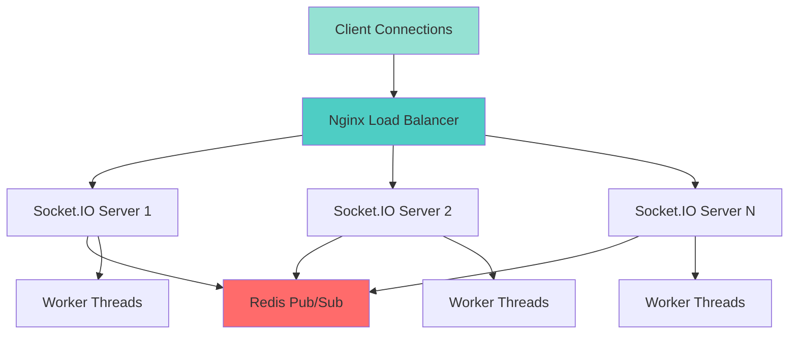
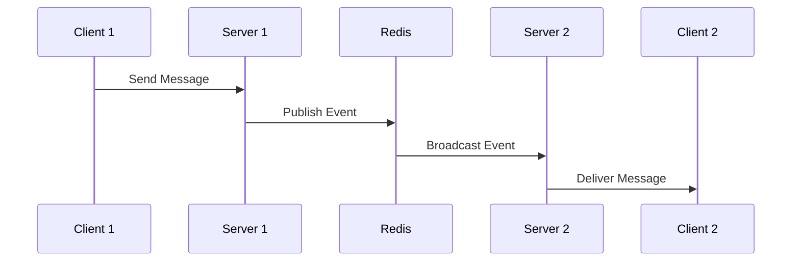

# Socket.IO TypeScript Boilerplate - Complete Guide

## Table of Contents
- [Quick Start](#quick-start)
- [Architecture Overview](#architecture-overview)
- [Core Concepts](#core-concepts)
- [Usage Examples](#usage-examples)
- [Advanced Features](#advanced-features)
- [Testing](#testing)
- [Deployment](#deployment)
- [Performance Tuning](#performance-tuning)
- [Troubleshooting](#troubleshooting)

---

## Quick Start

### Prerequisites
Ensure you have the following installed:
- **Node.js** 18.x or higher
- **Redis** 6.x or higher
- **C++ Compiler** (for uWebSockets.js)
  - Linux: `sudo apt-get install build-essential`
  - macOS: `xcode-select --install`
  - Windows: Visual Studio with C++ Build Tools

### Installation

1. **Clone the repository**
   ```bash
   git clone https://github.com/DVNghiem/Socket.io-Boilerplate
   cd Socket.io-Boilerplate
   ```

2. **Install dependencies**
   ```bash
   npm install
   ```

3. **Set up environment variables**
   ```bash
   cp .env.example .env
   ```
   
   Edit `.env` to configure your settings:
   ```env
   PORT=3000
   REDIS_HOST=localhost
   REDIS_PORT=6379
   NODE_ENV=development
   LOG_LEVEL=info
   ```

4. **Start Redis**
   ```bash
   # Using Docker (recommended)
   docker run -d -p 6379:6379 --name redis redis:latest
   
   # Or using local installation
   redis-server
   ```

5. **Run the application**
   ```bash
   # Development mode with hot reload
   npm run dev
   
   # Production mode
   npm run build
   npm start
   ```

Your Socket.IO server is now running on `http://localhost:3000`! 🚀

---

## Architecture Overview

This boilerplate uses a modular, scalable architecture built on proven design patterns:



### Design Patterns

#### 1. **Singleton Pattern** - `SocketManager` & `EventEmitter`
Ensures single instances for Socket.IO server and event management.

```typescript
// Only one instance exists throughout the application
const socketManager = SocketManager.getInstance();
const eventEmitter = EventEmitter.getInstance();
```

#### 2. **Factory Pattern** - `RoomFactory`
Creates and manages room instances on-demand.

```typescript
// Automatically creates rooms if they don't exist
const room = RoomFactory.getRoom('room-123');
```

#### 3. **Observer Pattern** - `EventEmitter`
Decouples event producers from consumers.

```typescript
// Register handlers for events
EventEmitter.getInstance().on('chat:message', new ChatMessageHandler());
```

#### 4. **Strategy Pattern** - Message & Worker Strategies
Allows different processing algorithms to be swapped at runtime.

```typescript
// Different strategies for different message types
const chatStrategy = new ChatStrategy();
const notificationStrategy = new NotificationStrategy();
```

### Project Structure

```
src/
├── config/              # Configuration management
│   └── index.ts         # Environment variables & settings
├── core/                # Core framework components
│   ├── event/           # Event handling system
│   │   ├── EventEmitter.ts
│   │   ├── EventHandler.ts
│   │   └── handlers/    # Event handler implementations
│   ├── socket/          # Socket.IO management
│   │   ├── SocketManager.ts
│   │   └── adapters/    # Redis adapter
│   └── strategy/        # Message processing strategies
│       ├── MessageStrategy.ts
│       └── strategies/  # Strategy implementations
├── modules/             # Feature modules
│   └── room/            # Room management
│       ├── Room.ts
│       └── RoomFactory.ts
├── workers/             # Worker thread system
│   ├── WorkerManager.ts
│   ├── WorkerThread.ts
│   ├── base/            # Worker base classes
│   └── strategies/      # Worker strategies
├── utils/               # Utilities
│   └── Logger.ts        # Winston logger
└── index.ts             # Application entry point
```

---

## Core Concepts

### 1. Event System

The event system provides type-safe event handling with automatic error recovery.

**Event Map** (defined in `EventEmitter.ts`):
```typescript
export interface EventMap {
  'client:connect': [Socket];
  'client:disconnect': [Socket];
  'chat:message': [Socket, any];
  // Add your custom events here
}
```

**Registering Event Handlers**:
```typescript
import { EventEmitter } from './core/event/EventEmitter';
import { MyCustomHandler } from './handlers/MyCustomHandler';

EventEmitter.getInstance().on('my:event', new MyCustomHandler());
```

**Emitting Events**:
```typescript
EventEmitter.getInstance().emit('chat:message', socket, messageData);
```

### 2. Room Management

Rooms allow you to broadcast messages to specific groups of clients.

```typescript
import { RoomFactory } from './modules/room/RoomFactory';

// Get or create a room
const room = RoomFactory.getRoom('game-room-1');

// Add a client to the room
room.join(socket);

// Broadcast to all clients in the room
room.broadcast(socket, 'game:update', gameState);
```

### 3. Worker Threads

Heavy computations are offloaded to worker threads to keep the main event loop responsive.

```typescript
import { WorkerManager } from './workers/WorkerManager';

const workerManager = new WorkerManager();

// Process a task using a specific strategy
await workerManager.processMessage(taskId, data, 'analytics');
```

### 4. Redis Adapter

The Redis adapter enables horizontal scaling by synchronizing events across multiple server instances.



---

## Usage Examples

### Example 1: Basic Chat Application

**Server Setup** (already configured in `index.ts`):
```typescript
import { SocketManager } from './core/socket/SocketManager';
import { EventEmitter } from './core/event/EventEmitter';
import { ClientConnectHandler } from './core/event/handlers/ClientConnectHandler';
import { ChatMessageHandler } from './core/event/handlers/ChatMessageHandler';

SocketManager.getInstance();
EventEmitter.getInstance().on('client:connect', new ClientConnectHandler());
EventEmitter.getInstance().on('chat:message', new ChatMessageHandler());
```

**Client Implementation** (HTML/JavaScript):
```html
<!DOCTYPE html>
<html>
<head>
    <title>Socket.IO Chat</title>
    <script src="https://cdn.socket.io/4.8.1/socket.io.min.js"></script>
</head>
<body>
    <div id="messages"></div>
    <input id="messageInput" type="text" placeholder="Type a message...">
    <button onclick="sendMessage()">Send</button>

    <script>
        const socket = io('http://localhost:3000', { 
            transports: ['websocket'] 
        });

        socket.on('connect', () => {
            console.log('Connected:', socket.id);
            // Join a room
            socket.emit('join:room', 'general');
        });

        socket.on('chat:message', (message) => {
            const div = document.createElement('div');
            div.textContent = `${message.user}: ${message.content}`;
            document.getElementById('messages').appendChild(div);
        });

        function sendMessage() {
            const input = document.getElementById('messageInput');
            socket.emit('chat:message', {
                roomId: 'general',
                content: input.value,
                user: socket.id
            });
            input.value = '';
        }
    </script>
</body>
</html>
```

### Example 2: Creating a Custom Event Handler

**1. Define the event in EventMap**:
```typescript
// src/core/event/EventEmitter.ts
export interface EventMap {
  'client:connect': [Socket];
  'client:disconnect': [Socket];
  'chat:message': [Socket, any];
  'notification:send': [Socket, NotificationData]; // New event
}
```

**2. Create the handler**:
```typescript
// src/core/event/handlers/NotificationHandler.ts
import { Socket } from 'socket.io';
import { EventHandler } from '../EventHandler';
import { Logger } from '../../../utils/Logger';

export interface NotificationData {
  title: string;
  message: string;
  type: 'info' | 'warning' | 'error';
}

export class NotificationHandler implements EventHandler<[Socket, NotificationData]> {
  handle(socket: Socket, data: NotificationData): void {
    Logger.info(`Sending notification to ${socket.id}: ${data.title}`);
    
    // Send to the specific client
    socket.emit('notification:received', {
      ...data,
      timestamp: new Date().toISOString()
    });
  }
}
```

**3. Register the handler**:
```typescript
// src/index.ts
import { NotificationHandler } from './core/event/handlers/NotificationHandler';

EventEmitter.getInstance().on('notification:send', new NotificationHandler());
```

**4. Use it in your code**:
```typescript
EventEmitter.getInstance().emit('notification:send', socket, {
  title: 'Welcome!',
  message: 'Thanks for connecting',
  type: 'info'
});
```

### Example 3: Creating a Custom Message Strategy

**1. Create the strategy**:
```typescript
// src/core/strategy/strategies/GameStrategy.ts
import { Socket } from 'socket.io';
import { MessageStrategy } from '../MessageStrategy';
import { RoomFactory } from '../../../modules/room/RoomFactory';
import { Logger } from '../../../utils/Logger';

export class GameStrategy implements MessageStrategy {
  async process(socket: Socket, message: any): Promise<void> {
    try {
      Logger.info(`Processing game action: ${message.action}`);
      
      // Validate game action
      if (!this.isValidAction(message.action)) {
        socket.emit('game:error', { error: 'Invalid action' });
        return;
      }
      
      // Process game logic
      const result = this.processGameAction(message);
      
      // Broadcast to room
      const room = RoomFactory.getRoom(message.gameId);
      room.broadcast(socket, 'game:update', result);
      
    } catch (error) {
      Logger.error(`GameStrategy error: ${(error as Error).message}`);
      socket.emit('game:error', { error: 'Game processing failed' });
    }
  }
  
  private isValidAction(action: string): boolean {
    const validActions = ['move', 'attack', 'defend', 'use_item'];
    return validActions.includes(action);
  }
  
  private processGameAction(message: any): any {
    // Your game logic here
    return {
      gameId: message.gameId,
      action: message.action,
      result: 'success',
      timestamp: Date.now()
    };
  }
}
```

**2. Create the handler**:
```typescript
// src/core/event/handlers/GameActionHandler.ts
import { Socket } from 'socket.io';
import { EventHandler } from '../EventHandler';
import { GameStrategy } from '../../strategy/strategies/GameStrategy';

export class GameActionHandler implements EventHandler<[Socket, any]> {
  private strategy = new GameStrategy();

  handle(socket: Socket, message: any): void {
    this.strategy.process(socket, message);
  }
}
```

**3. Register and use**:
```typescript
// src/index.ts
EventEmitter.getInstance().on('game:action', new GameActionHandler());

// In ClientConnectHandler, add:
socket.on('game:action', (message: any) => {
  EventEmitter.getInstance().emit('game:action', socket, message);
});
```

### Example 4: Creating a Custom Worker Strategy

**1. Create the worker strategy**:
```typescript
// src/workers/strategies/ImageProcessingWorkerStrategy.ts
import { WorkerStrategy } from '@workers/base/WorkerStrategy';
import { Logger } from '@utils/Logger';

export class ImageProcessingWorkerStrategy implements WorkerStrategy {
  name = 'image-processing';

  process(message: any): any {
    Logger.info(`Processing image: ${message.imageId}`);
    
    // Simulate heavy image processing
    const startTime = Date.now();
    
    // Your image processing logic here
    const result = {
      imageId: message.imageId,
      processed: true,
      filters: message.filters,
      processingTime: Date.now() - startTime,
      url: `https://cdn.example.com/processed/${message.imageId}.jpg`
    };
    
    Logger.info(`Image processed in ${result.processingTime}ms`);
    return result;
  }
}
```

**2. Register in WorkerManager**:
```typescript
// src/workers/WorkerManager.ts
import { ImageProcessingWorkerStrategy } from './strategies/ImageProcessingWorkerStrategy';

private registerStrategies() {
  this.strategies.set('chat', new ChatWorkerStrategy());
  this.strategies.set('analytics', new AnalyticsWorkerStrategy());
  this.strategies.set('image-processing', new ImageProcessingWorkerStrategy());
}
```

**3. Register in WorkerThread**:
```typescript
// src/workers/WorkerThread.ts
import { ImageProcessingWorkerStrategy } from '@workers/strategies/ImageProcessingWorkerStrategy';

const strategies = new Map<string, any>([
  ['chat', new ChatWorkerStrategy()],
  ['analytics', new AnalyticsWorkerStrategy()],
  ['image-processing', new ImageProcessingWorkerStrategy()],
]);
```

**4. Use it**:
```typescript
const workerManager = new WorkerManager();
const result = await workerManager.processMessage(
  'task-123',
  { imageId: 'img-456', filters: ['blur', 'sharpen'] },
  'image-processing'
);
```

---

## Advanced Features

### Horizontal Scaling

To handle 500k+ concurrent connections, run multiple server instances behind Nginx:

**1. Start multiple instances**:
```bash
PORT=3000 npm start &
PORT=3001 npm start &
PORT=3002 npm start &
PORT=3003 npm start &
```

**2. Configure Nginx** (already provided in `nginx.conf`):
```nginx
upstream socketio_backend {
    ip_hash;  # Sticky sessions
    server 127.0.0.1:3000;
    server 127.0.0.1:3001;
    server 127.0.0.1:3002;
    server 127.0.0.1:3003;
}
```

**3. Start Nginx**:
```bash
sudo nginx -c /path/to/nginx.conf
```

### Using Node.js Cluster Module

For even better performance, use the cluster module:

```typescript
// src/cluster.ts
import cluster from 'cluster';
import os from 'os';
import { Logger } from './utils/Logger';

if (cluster.isPrimary) {
  const numCPUs = os.cpus().length;
  Logger.info(`Master process ${process.pid} is running`);
  Logger.info(`Forking ${numCPUs} workers...`);

  for (let i = 0; i < numCPUs; i++) {
    cluster.fork();
  }

  cluster.on('exit', (worker, code, signal) => {
    Logger.error(`Worker ${worker.process.pid} died. Restarting...`);
    cluster.fork();
  });
} else {
  // Worker processes run the Socket.IO server
  require('./index');
  Logger.info(`Worker ${process.pid} started`);
}
```

Run with:
```bash
ts-node src/cluster.ts
```

### Redis Cluster for High Availability

For production, use Redis Cluster:

```bash
# Create Redis cluster
docker run -d --name redis-cluster -p 7000-7005:7000-7005 \
  redis:latest redis-cli --cluster create \
  127.0.0.1:7000 127.0.0.1:7001 127.0.0.1:7002 \
  127.0.0.1:7003 127.0.0.1:7004 127.0.0.1:7005 \
  --cluster-replicas 1
```

Update your config:
```typescript
// src/config/index.ts
export const config = {
  redis: {
    cluster: [
      { host: '127.0.0.1', port: 7000 },
      { host: '127.0.0.1', port: 7001 },
      { host: '127.0.0.1', port: 7002 },
    ]
  }
};
```

---

## Testing

### Unit Testing with Jest

**Install Jest**:
```bash
npm install --save-dev jest @types/jest ts-jest
```

**Configure Jest** (`jest.config.js`):
```javascript
module.exports = {
  preset: 'ts-jest',
  testEnvironment: 'node',
  moduleNameMapper: {
    '^@workers/(.*)$': '<rootDir>/src/workers/$1',
    '^@utils/(.*)$': '<rootDir>/src/utils/$1',
  },
};
```

**Example Test**:
```typescript
// src/modules/room/__tests__/RoomFactory.test.ts
import { RoomFactory } from '../RoomFactory';

describe('RoomFactory', () => {
  it('should create a new room', () => {
    const room = RoomFactory.getRoom('test-room');
    expect(room).toBeDefined();
  });

  it('should return the same room instance', () => {
    const room1 = RoomFactory.getRoom('test-room');
    const room2 = RoomFactory.getRoom('test-room');
    expect(room1).toBe(room2);
  });
});
```

### Load Testing with Artillery

**Install Artillery**:
```bash
npm install -g artillery
```

**Create test scenario** (`artillery-test.yml`):
```yaml
config:
  target: 'http://localhost:3000'
  phases:
    - duration: 60
      arrivalRate: 100
      name: "Warm up"
    - duration: 120
      arrivalRate: 500
      name: "Sustained load"
  socketio:
    transports: ['websocket']

scenarios:
  - name: 'Chat Test'
    engine: socketio
    flow:
      - emit:
          channel: 'join:room'
          data: 'test-room'
      - think: 1
      - emit:
          channel: 'chat:message'
          data:
            roomId: 'test-room'
            content: 'Hello from Artillery!'
      - think: 2
```

**Run the test**:
```bash
artillery run artillery-test.yml
```

---

## Deployment

### Docker Deployment

**Dockerfile**:
```dockerfile
FROM node:18-alpine

# Install build tools for uWebSockets.js
RUN apk add --no-cache python3 make g++

WORKDIR /app

COPY package*.json ./
RUN npm ci --only=production

COPY . .
RUN npm run build

EXPOSE 3000

CMD ["node", "dist/index.js"]
```

**docker-compose.yml**:
```yaml
version: '3.8'

services:
  redis:
    image: redis:latest
    ports:
      - "6379:6379"
    volumes:
      - redis-data:/data

  socketio-1:
    build: .
    ports:
      - "3000:3000"
    environment:
      - PORT=3000
      - REDIS_HOST=redis
      - REDIS_PORT=6379
      - NODE_ENV=production
    depends_on:
      - redis

  socketio-2:
    build: .
    ports:
      - "3001:3000"
    environment:
      - PORT=3000
      - REDIS_HOST=redis
      - REDIS_PORT=6379
      - NODE_ENV=production
    depends_on:
      - redis

  nginx:
    image: nginx:latest
    ports:
      - "80:80"
    volumes:
      - ./nginx.conf:/etc/nginx/nginx.conf:ro
    depends_on:
      - socketio-1
      - socketio-2

volumes:
  redis-data:
```

**Deploy**:
```bash
docker-compose up -d
```

### PM2 Deployment

**Install PM2**:
```bash
npm install -g pm2
```

**ecosystem.config.js**:
```javascript
module.exports = {
  apps: [{
    name: 'socketio-server',
    script: 'dist/index.js',
    instances: 'max',
    exec_mode: 'cluster',
    env: {
      NODE_ENV: 'production',
      PORT: 3000
    }
  }]
};
```

**Start**:
```bash
npm run build
pm2 start ecosystem.config.js
pm2 save
pm2 startup
```

---

## Performance Tuning

### System-Level Optimizations

**Increase file descriptor limits**:
```bash
# /etc/security/limits.conf
* soft nofile 65535
* hard nofile 65535
```

**Kernel tuning**:
```bash
sudo sysctl -w net.core.somaxconn=65535
sudo sysctl -w net.ipv4.tcp_max_syn_backlog=8192
sudo sysctl -w net.ipv4.ip_local_port_range="1024 65535"
sudo sysctl -w net.ipv4.tcp_tw_reuse=1
sudo sysctl -w net.ipv4.tcp_fin_timeout=30
```

### Application-Level Optimizations

**1. Enable compression**:
```typescript
// src/core/socket/SocketManager.ts
this.io = new Server({
  cors: { origin: '*' },
  transports: ['websocket'],
  perMessageDeflate: {
    threshold: 1024 // Compress messages > 1KB
  }
});
```

**2. Limit max listeners**:
```typescript
// src/core/event/EventEmitter.ts
this.emitter.setMaxListeners(100);
```

**3. Use binary data when possible**:
```typescript
// Send binary data instead of JSON
socket.emit('data', Buffer.from([1, 2, 3, 4]));
```

### Monitoring

**Add monitoring with Prometheus**:
```typescript
// src/utils/Metrics.ts
import { register, Counter, Gauge } from 'prom-client';

export const connectedClients = new Gauge({
  name: 'socketio_connected_clients',
  help: 'Number of connected clients'
});

export const messagesReceived = new Counter({
  name: 'socketio_messages_received_total',
  help: 'Total messages received'
});
```

---

## Troubleshooting

### Common Issues

#### 1. **uWebSockets.js compilation fails**

**Error**: `gyp ERR! build error`

**Solution**:
```bash
# Linux
sudo apt-get install build-essential

# macOS
xcode-select --install

# Windows
# Install Visual Studio Build Tools
npm install --global windows-build-tools

# Reinstall
npm install uWebSockets.js
```

#### 2. **Redis connection fails**

**Error**: `Redis connection refused`

**Solution**:
```bash
# Check if Redis is running
redis-cli ping
# Should return: PONG

# Start Redis if not running
redis-server

# Or with Docker
docker run -d -p 6379:6379 redis
```

#### 3. **Worker threads not working**

**Error**: `Cannot find module '@workers/WorkerThread'`

**Solution**: Ensure `tsconfig-paths` is registered:
```bash
# Development
npx nodemon  # Already configured in nodemon.json

# Production
npm run build  # Compiles to dist/
```

#### 4. **High memory usage**

**Symptoms**: Server crashes with `JavaScript heap out of memory`

**Solution**:
```bash
# Increase Node.js memory limit
node --max-old-space-size=4096 dist/index.js

# Or in package.json
"start": "node --max-old-space-size=4096 dist/index.js"
```

#### 5. **Clients can't connect**

**Checklist**:
- [ ] Server is running: `curl http://localhost:3000`
- [ ] Firewall allows connections
- [ ] CORS is configured: Check `SocketManager.ts`
- [ ] Client uses correct transport: `{ transports: ['websocket'] }`

#### 6. **Messages not syncing across servers**

**Symptoms**: Messages only reach clients on the same server

**Solution**:
- Verify Redis is running and accessible
- Check Redis adapter logs
- Ensure all servers connect to the same Redis instance

### Debug Mode

Enable detailed logging:

```typescript
// src/utils/Logger.ts
private static logger = winston.createLogger({
  level: process.env.LOG_LEVEL || 'debug',  // Change to 'debug'
  // ...
});
```

Or set in `.env`:
```env
LOG_LEVEL=debug
```

### Performance Debugging

**Monitor event loop lag**:
```typescript
// src/utils/EventLoopMonitor.ts
import { Logger } from './Logger';

let lastCheck = Date.now();

setInterval(() => {
  const now = Date.now();
  const lag = now - lastCheck - 1000;
  
  if (lag > 100) {
    Logger.warn(`Event loop lag: ${lag}ms`);
  }
  
  lastCheck = now;
}, 1000);
```

---

## Additional Resources

- [Socket.IO Documentation](https://socket.io/docs/v4/)
- [uWebSockets.js GitHub](https://github.com/uNetworking/uWebSockets.js)
- [Redis Documentation](https://redis.io/docs/)
- [Node.js Worker Threads](https://nodejs.org/api/worker_threads.html)

## Support

For issues and questions:
- GitHub Issues: [Socket.io-Boilerplate Issues](https://github.com/DVNghiem/Socket.io-Boilerplate/issues)
- Documentation: This guide

---

**Happy coding! 🚀**
